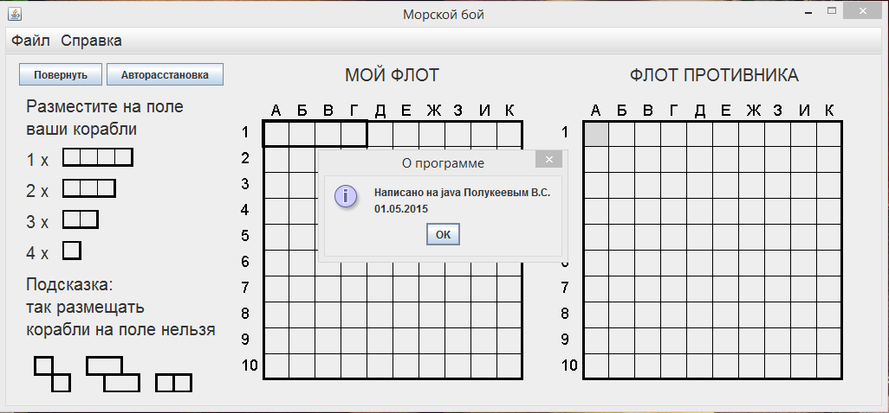

# Seabattle
Seabattle is my first application that I have written at Java

### Requirements

- Java 7

### How to run

**Linux:**

1. Open terminal
1. Move to project directory
1. Execute command `java -jar out/artifacts/Seabattlev03_jar/Seabattlev03.jar`

**Windows**

1. Open File explorer
1. Move to project directory
1. Move to directory `out`, than `artifacts` and than `Seabattlev03_jar`
1. Execute `seabattle.exe`

### Screenshot:

